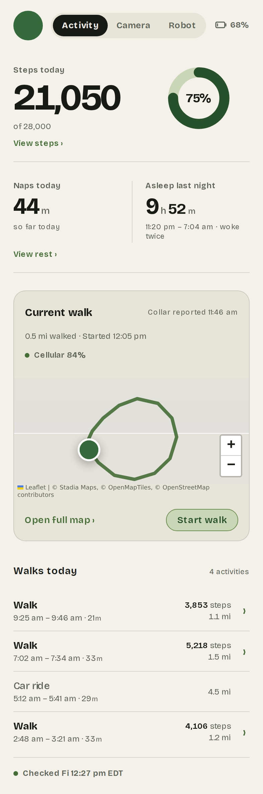
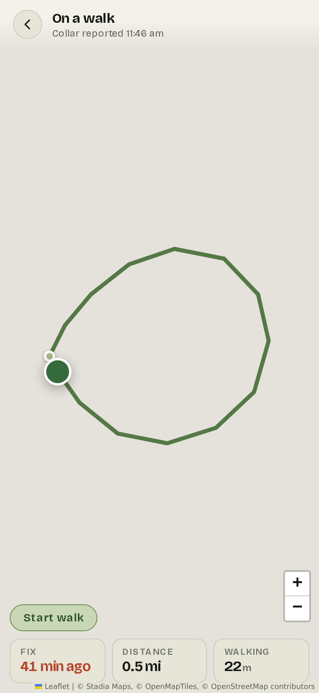
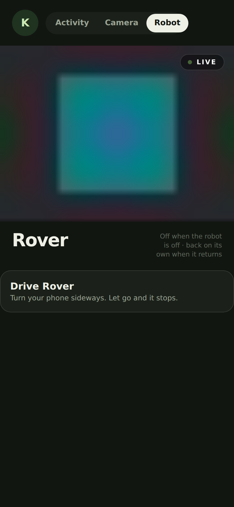
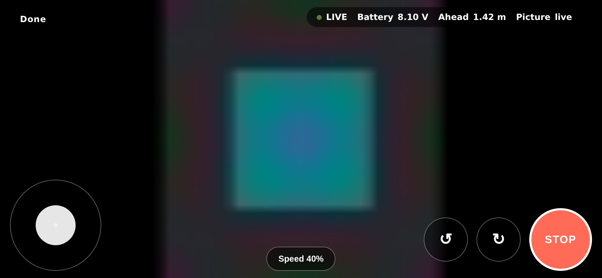
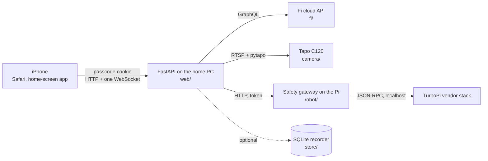

# kona-tracker

[](https://github.com/chris-suryo/kona-tracker/actions/workflows/ci.yml)

[](LICENSE)

A private, passcode-gated web app for checking on a dog. It reads a Fi smart
collar, streams a camera in the house, and drives a small robot around the
rooms, all from a phone. Built for two people and one Labrador.

| | |
|---|---|
|  |  |
|  |  |

## Features

- **Activity** from a Fi collar: steps against the daily goal, sleep and naps,
  today by the hour, where she is on a map, and a walk log with each route.
- **Camera**: live video from a Tapo C120 over RTSP, with pinch-to-zoom and the
  camera's own night vision, privacy mode and status light.
- **Robot**: live view from a Hiwonder TurboPi and a landscape drive mode with
  two joysticks, driven through a safety gateway on the Pi.
- One shared passcode. No accounts and no per-person setup.
- iPhone-first, installable to the home screen, light and dark themes.
- FastAPI, Jinja templates, plain CSS and plain JavaScript. No build step, no
  framework, no npm.

## Requirements

- Python 3.11 or newer, and [uv](https://docs.astral.sh/uv/).
- A machine at home to run it on, because the camera stream originates there.
- Optional hardware, each independent of the others: a Fi collar account, a
  Tapo C120 camera, a Hiwonder TurboPi with the safety gateway installed.
  Anything not configured is absent from the app rather than broken in it.

## Quick start

No hardware needed.

```bash
git clone https://github.com/chris-suryo/kona-tracker.git
cd kona-tracker
uv sync
cp .env.example .env        # set KONA_PASSCODE and KONA_SECRET
uv run kona serve --fake-camera
```

Open http://localhost:8000 and enter the passcode. The Camera tab shows a test
pattern, Activity waits for a collar, and the Robot tab appears once the robot
settings are filled in.

If Application Control blocks the virtualenv's `.exe` shims,
`uv run python -m kona_tracker serve --fake-camera` runs the same command.

`docs/first-run.md` covers the same ground in plain language, including the real
camera, the collar, the robot, and getting it onto a phone.

## Configuration

Every setting is an environment variable read from `.env`. `.env.example`
documents all forty of them with the reasoning behind each default. The ones
that matter to start:

| Variable | What it does |
|---|---|
| `KONA_PASSCODE` | The shared passcode. Required. |
| `KONA_SECRET` | Signs the session cookie. Any long random string. Required. |
| `FI_EMAIL`, `FI_PASSWORD` | The Fi app login. Without them the Activity tab says which two lines are missing. |
| `KONA_CAMERA_SOURCE` | `usb`, `rtsp` or `fake`. |
| `KONA_RTSP_URL` | The camera's stream, for `rtsp`. |
| `KONA_ROBOT_SNAPSHOT_URL` | The robot's camera. Enables the Robot tab. |
| `KONA_ROBOT_CONTROL_URL`, `KONA_ROBOT_TOKEN` | The Pi-side safety gateway. Enables drive mode. |
| `KONA_PREVIEW` | Serves the sample-data pages. Off by default. |

Reaching the app from outside the house is `docs/remote-access.md`: a Cloudflare
tunnel or Tailscale, and the one setting that breaks login if it is wrong.

## Pages

| Path | What it shows |
|---|---|
| `/activity` | Steps, rest, last night, where she is, walks today. Updates in place once a minute; pull down to force a refresh. |
| `/steps`, `/rest` | Today's steps by the hour. Sleep and naps by the hour, then one bar per day since the collar came online. Drag across a chart to read it. |
| `/walks/<id>` | One walk: distance, pace, and the route on a map. |
| `/map` | The map full screen, polling on its own clock, for following a walk. |
| `/camera` | The picture. Pinch or double-tap to zoom. Night vision, privacy and the status light when the camera answers. |
| `/robot` | The robot's camera and its front lights. |
| `/drive` | Landscape drive mode: two joysticks, rotate buttons, and a stop button. |
| `/settings` | Profile, appearance, sign out, build. |
| `/preview/steps`, `/preview/rest` | Sample data for judging layout without a collar. Requires `KONA_PREVIEW`. |
| `/activity.json`, `/map.json`, `/status.json`, `/healthz` | The same facts as JSON, for a script or a watchdog. |

## Architecture



| Package | Contents |
|---|---|
| `fi/` | GraphQL client, the queries, the parser, and the service that refreshes a snapshot on a timer. |
| `probe/` | `kona probe`: discovery against Fi's undocumented API, redacted before anything is written. |
| `camera/` | Frame sources (USB, RTSP, fake), the hub that serves one frame at a time, and the Tapo controls. |
| `robot/` | The gateway client. The only code that moves the robot. |
| `store/` | Optional SQLite recorder of what the collar reported. |
| `web/` | `app.py` builds the app, `routes/` holds one router per domain, `views/` formats a snapshot for the templates, `static/` holds the CSS and JavaScript. |

Five decisions worth knowing about, each with the file that explains it:

- Fi has no public API, so `probe/` discovers it by asking for one speculative
  field per query and reading the validation error to find the next one.
- The robot holds a motor duty until another arrives, so the dead-man switch
  runs on the Pi and the browser never chooses its length (`robot/gateway.py`).
- Drive commands go over a WebSocket on the phone-to-server leg, which is the
  slow one. A task on the server refreshes the Pi on a steady clock
  (`web/routes/robot.py`).
- The Content-Security-Policy allows no inline script or style, and every asset
  including the webfont is served from this origin (`web/app.py`).
- CI runs on Ubuntu and Windows because the app is served from a Windows PC,
  where `%-d` raises rather than formatting (`web/build.py`).

## Development

```bash
uv run pytest -q
uv run ruff check .
uv run ruff format --check .
```

CI runs those three on Ubuntu and Windows, Python 3.11 and 3.12. Tests live
beside the code they cover, and a change to logic comes with a test.

Two checks are run by hand, because CI has no browser.
`tests/browser_runtime.test.cjs` exercises the page scripts under Node with a
stubbed DOM. `scripts/audit_shots.js` captures every page in both themes
against `scripts/audit_server.py`; `docs/screenshots/README.md` lists what a
captured screenshot does and does not represent.

Most of the code was written in Claude Code sessions. Every change went through
a pull request with CI green on both platforms. `CLAUDE.md` is the standing
brief, `PROJECT.md` the running status, and `docs/history/` keeps the working
notes from each day.

## Documentation

| File | Contents |
|---|---|
| `PROJECT.md` | Current status, hard-won facts, and the queue. |
| `docs/first-run.md` | Setting it up, in plain language. |
| `docs/remote-access.md` | Tunnel, Tailscale, keeping the PC awake, what breaks. |
| `docs/device-capabilities.md` | What the hardware can do, measured. |
| `docs/data-brief.md` | What Fi's API returns and what the pages may claim. |
| `docs/scaling-limits.md` | Known ceilings, with the measurements behind each. |
| `docs/recording.md` | The optional SQLite recorder. |
| `docs/robot-bringup.md` | Bringing the robot up, in order. |
| `docs/robot-runbook.md` | What to do when the robot will not connect. |
| `docs/robot-measurements.md` | Three measurements that need someone in the room. |
| `docs/history/` | Dated working notes, kept as a record. |

## Status

Running daily on a Windows PC at home and watched from two iPhones. The collar,
the camera and the robot all work. Drive mode has been used on the real robot;
its strafe axes, its battery headroom under sustained throttle, and the camera
quality over a cellular connection are still unmeasured. `PROJECT.md` is the
current state and the queue.

## Privacy

`.env` holds a Fi password, the passcode, a session secret, a robot token and an
optional map key. `probe-out/` holds what Fi's API returned about the dog. Both
are gitignored. The probe redacts emails, session ids, locations, addresses and
hardware ids before writing anything. The documentation uses TEST-NET addresses
and a placeholder home directory, and a test keeps it that way.

## License

MIT, in `LICENSE`. Two vendored dependencies keep their own: Leaflet under
`src/kona_tracker/web/static/leaflet/` (BSD-2) and Bricolage Grotesque under
`src/kona_tracker/web/static/fonts/` (OFL).
