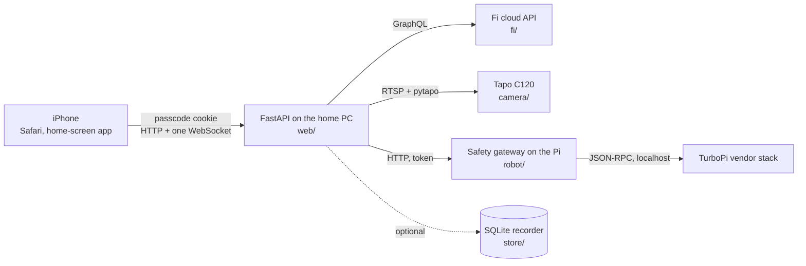

# kona-tracker

[](https://github.com/chris-suryo/kona-tracker/actions/workflows/ci.yml)

[](LICENSE)

A private, passcode-gated, iPhone-first web app so two people can check on
Kona, a one-year-old Labrador, from wherever they are. Three tabs: **Activity**
from her Fi collar (steps against her goal, sleep and naps, today by the hour,
where she is on a map, a walk log with each route), **Camera**, live video from
a Tapo C120 in the house with the camera's own switches, and **Robot**, a
Hiwonder TurboPi that can be driven around the house from a phone -- two
thumbs on two joysticks, a picture in between, and a Pi-side safety gateway
that stops the wheels the moment the phone goes quiet.

| | |
|---|---|
|  |  |
|  |  |

Python: FastAPI, Jinja templates, plain CSS and plain JavaScript. No build
step, no JavaScript framework, no npm. It runs on a PC at home because the
video originates there. It is for two people and one dog; it is not a product.

## Why I built this

The Fi app is fine, but two people wanted one glance -- her steps, whether she
slept, where she is, and the room she is in -- on a phone, without an account
each. Fi has no public API, so the first thing this project built was a probe
that asks the undocumented one what it knows, one unknown per round, and writes
the answer down redacted. The robot came later and for a different reason: the
vendor's control stack holds a motor duty indefinitely, so a lost "stop" is a
robot that keeps going. Every drive command here passes through a gateway on
the Pi that zeroes the motors when commands stop arriving, and the browser is
never allowed to choose how long that grace period is.

## What's interesting in here

- **An API discovered by asking.** `src/kona_tracker/probe/` logs in to Fi's
  GraphQL and asks one speculative field per query, so the validation error
  names the next thing to try. Eleven rounds against a real collar; the query
  set in `fi/queries.py` is the result. The test double in `tests/conftest.py`
  rejects the malformed query that once shipped, because *a mock that answers
  any query tests the parser, not the query.*
- **A dead-man switch the browser cannot loosen.** `robot/gateway.py` sends a
  body velocity every 200 ms against a 500 ms TTL that the page never sees;
  the reasoning is the module docstring. `/robot/stop` answers 503 when the
  robot is silent rather than a comforting 200.
- **Driving over one connection, with the server pumping.** The slow leg is
  phone → PC over LTE, not PC → Pi over Ethernet, so the WebSocket lives on the
  first (`web/routes/robot.py`). Frames set a command; a server-side task
  refreshes the Pi on a steady clock and lets go after 600 ms of silence. The
  handshake is not covered by the HTTP middleware, so the cookie is checked
  before `accept()` -- there is a test that signs out and tries.
- **A Content-Security-Policy with no inline anything**, and the three times it
  bit silently -- an `onerror=`, a theme script, six colour swatches written as
  `style=` -- each now a test (`tests/test_web.py`, the inline-style and
  inline-script guards). A tile-by-tile record of what fails without a sound.
- **CI on Ubuntu *and* Windows, because the app's home is a Windows PC.**
  `%-d` is a glibc extension that raises on Windows; Ubuntu was green and the
  Settings page would have 500'd on the machine it runs on. `web/build.py`
  carries the story; `tests/test_clock.py` guards the directive set.

## Run it in five minutes, no hardware needed

Needs [uv](https://docs.astral.sh/uv/) and Python 3.11+.

```
git clone https://github.com/chris-suryo/kona-tracker.git
cd kona-tracker
uv sync
cp .env.example .env        # set KONA_PASSCODE and KONA_SECRET
uv run kona serve --fake-camera
```

Open http://localhost:8000 and enter the passcode. The Camera tab shows a test
pattern; Activity waits for a collar; Robot appears once `KONA_ROBOT_*` is
set. On a machine where Application Control blocks the venv's `.exe` shims,
`uv run python -m kona_tracker serve --fake-camera` is the same command.
`docs/first-run.md` is the plain-language version, including the real camera,
the collar, the robot and getting it onto a phone.

## How it fits together



| Package | What lives there |
|---|---|
| `fi/` | The GraphQL client, the queries the probe found, the parser, and the service that refreshes a snapshot on a timer (faster during a walk). |
| `probe/` | `kona probe`: discovery against Fi's undocumented API, redacted before anything is written. |
| `camera/` | Frame sources (USB, RTSP, a steerable fake), the hub that reads one and serves a frame at a time, the Tapo switches. |
| `robot/` | The gateway client -- the only code that moves the robot. |
| `store/` | The optional SQLite recorder of what the collar reported. |
| `web/` | `app.py` builds the app; `routes/` holds one router per domain; `views/` turns a snapshot into the exact strings the templates print; `static/` is the plain JavaScript and CSS. |

## Pages

| Path | What it shows |
|---|---|
| `/activity` | Steps, rest, last night, where she is, walks today. Refreshes in place once a minute while open; pull down for now. |
| `/steps`, `/rest` | Today's steps by the hour; sleep and naps by the hour, then one bar per day since the collar came online. Drag across a chart to read it. |
| `/walks/<id>` | One walk: distance, pace, the route on the map. |
| `/map` | The map, full screen, polling on its own clock -- for watching a walk as it happens. |
| `/camera` | The picture. Pinch or double-tap to zoom. Night vision, privacy and the status light when the camera answers. |
| `/robot` | The robot's camera and its front lights; `/drive` is landscape drive mode with two joysticks and a STOP that is a stop. |
| `/settings` | Profile, appearance, sign out, and which build this is. |
| `/preview/steps`, `/preview/rest` | Sample data, for judging layout without a collar. Off unless `KONA_PREVIEW=1`. |
| `/activity.json`, `/map.json`, `/status.json`, `/healthz` | The same facts as JSON, for a script or a watchdog. |

## Commands

| Command | What it does |
|---|---|
| `uv run kona serve` | The app. `--fake-camera` for a test pattern, `--port`, `--host`. |
| `uv run kona probe --out probe-out/round12` | Ask Fi's API what it knows, redacted, into `summary.md`. One folder per round. |
| `uv run kona cameras` | Which USB camera indexes open. |
| `uv run kona camera-test` | Open the configured camera once and report size, fps, bytes per frame. Stop `kona serve` first. |
| `uv run kona camera-doctor` | Raw pixel statistics per index and backend, for a camera that opens but shows nothing. |

Every setting is an environment variable read from `.env`; `.env.example`
documents each one and the reasoning behind its default. Reaching it from
outside the house -- a Cloudflare tunnel or Tailscale, and the one setting
that silently breaks login if it is wrong -- is `docs/remote-access.md`.

## Development

```
uv run pytest -q
uv run ruff check .
uv run ruff format --check .
```

CI runs exactly those three on Ubuntu and Windows, Python 3.11 and 3.12, and
must stay green on every push. Tests live beside the code they cover; a change
to logic comes with a test. Two more checks are run by hand, because CI has no
browser: `tests/browser_runtime.test.cjs` exercises the page scripts under
Node with a stubbed DOM, and `scripts/audit_shots.js` captures every page in
both themes against `scripts/audit_server.py`
(`docs/screenshots/README.md`).

## Built with AI, deliberately

Claude Code sessions did most of the typing. Every change went through a pull
request with CI green on both platforms; the commit messages carry the
reasoning, because that is what survives a session. `CLAUDE.md` is the
standing brief every session works under, `PROJECT.md` is the running status
and queue, `.claude/` holds the session hooks and skills, and `.dos/outbox/`
is each session's own account of what it did, wrong turns included.
`docs/history/` is the record: the handoffs, briefs and reports of the days
this was built on.

## The docs

| File | What it is |
|---|---|
| `PROJECT.md` | **Current.** Status, hard-won facts, the queue. |
| `docs/first-run.md` | Setting it up, in plain language. |
| `docs/remote-access.md` | Tunnel, Tailscale, keeping the PC awake, what breaks. |
| `docs/device-capabilities.md` | What the hardware can actually do, measured. Cameras, collar, robot. |
| `docs/data-brief.md` | What Fi's API returns and what the page may therefore claim. |
| `docs/scaling-limits.md` | The ceilings this design has, with the measurements behind each. |
| `docs/recording.md` | The optional SQLite recorder and what it keeps. |
| `docs/robot-bringup.md`, `docs/robot-runbook.md`, `docs/robot-measurements.md` | Bringing the robot up in order; what to do when it will not connect; the three measurements only a person in the room can take. |
| `docs/history/` | Dated working notes, kept for the record and not as instructions. |

## Privacy

`.env` holds a Fi password, a passcode, a session secret, a robot token and an
optional map key. `probe-out/` holds what Fi's API said about the dog. Both
are gitignored and neither is ever committed. The probe redacts emails,
session ids, locations, addresses and hardware ids before writing anything.
The docs use TEST-NET addresses and `<you>` for the home directory, and a test
keeps it that way.

## Licence

MIT (`LICENSE`). The vendored Leaflet under `src/kona_tracker/web/static/leaflet/`
keeps its own BSD-2 licence file.
